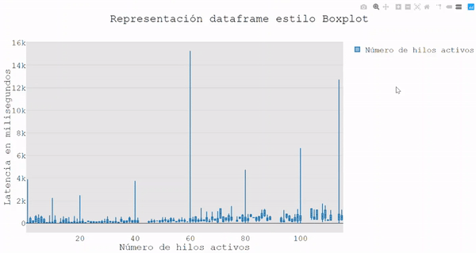

# Manual de uso \[ [sourceCode](https://github.com/RafaelGB/pythonScripts/tree/master/Graficas_Jmeter) \]

La funcionalidad del script es ofrecer información y material gráfico sobre los parámetros CSV que se obtienen de la herramienta JMeter

## Parámetros contemplados

* `-f <path>` \[OBLIGATORIO\]  Seleciona el/los fichero/s CSV en su ruta relativa o absoluta. Admite directorios donde busca cada CSV y también la ruta del fichero directamente
* `-m mode`* *\[OBLIGATORIO\]
  * `chunks`: La información recogida del CSV se tratará por intervalos. Cada uno de ellos devolverá su resultado independiente. El tamaño de dichos intervalos es configurable.
  * `full`:   La información recogida del CSV se tratará en su conjunto, devolviendo un único resultado.
* `-o option` \[OBLIGATORIO\]
  * `plotlyGraph`: En función de la columna que se determine como marcaje (`--column nombreHeader`), Devuelve una gráfica de tiempos.
  * `boxplot_seaborn`: \[DEPRECATED\] devuelve una imagen con un boxplot de latencia sobre bytes enviados.
  * `boxplot_plotly`: Devuelve una interfaz con un boxplot de la columna x (`--colx`), columna y (`--coly`) indicadas por parámetro.
  * `valores_unicos`: Dado el nombre de una columna determinada como parámetro (`--column`), obtiene todos los valores únicos y el número de veces que aparecen.
  * `system_metrics`: Con las métricas obtenidas del sistema al que ataca JMeter (usando un agente), devuelve una gráfica con cada medida parametrizada (CPU, Memoria, NetworkIO,...)
* `-h` ó `--help`: muetra por consola el manual de uso
* `--compare-mode`:  \[OPCIONAL\]  Para aquellas opciones de tipo traza, con esta opción recoge la gráfica obtenida de diferentes ficheros y genera una gráfica con todas las trazas superpuestas
* `--offset`:  En caso de querer inicializar la columna del CSV referente al tiempo a 0 ( facilita la comparativa entre gráficas con diferentes rangos temporales\
  \

## Ejemplos

Gráfica orientada a boxplots:

```shell
# Ejecución en modo full de la latencia sobre el número de hilos
python JMeterGraphs.py -f data.CSV -m full -o boxplot_plotly --colx allThreads --coly Latency
```

